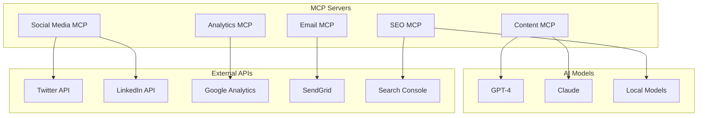

# 🚀 Marketing MCP Servers Suite

A comprehensive collection of MCP (Model Context Protocol) servers designed for modern marketing teams, enabling AI-powered automation across all marketing channels.

## 📦 Included Servers

### 1. Social Media MCP Server
Manage multi-platform social media campaigns with AI-powered optimization.
- **Platforms**: Twitter/X, LinkedIn, Instagram, Facebook, TikTok
- **Features**: Scheduling, analytics, hashtag optimization, media handling
- **AI Tools**: Content generation, best time posting, engagement prediction

### 2. Analytics MCP Server
Unified analytics across all marketing channels.
- **Integrations**: Google Analytics, social platforms, email tools
- **Features**: ROI tracking, attribution, custom dashboards
- **AI Tools**: Predictive analytics, anomaly detection, insights

### 3. Content Management MCP Server
AI-powered content creation and management.
- **Features**: Content generation, brand voice, version control
- **Storage**: Local/cloud, organized libraries
- **AI Tools**: Writing assistance, tone checking, optimization

### 4. Email Marketing MCP Server
Sophisticated email campaign automation.
- **Features**: List management, segmentation, A/B testing
- **Platforms**: SendGrid, Mailchimp, custom SMTP
- **AI Tools**: Subject line optimization, personalization

### 5. SEO Tools MCP Server
Comprehensive SEO optimization and monitoring.
- **Features**: Keyword research, technical SEO, backlinks
- **Integrations**: Google Search Console, SEMrush APIs
- **AI Tools**: Content optimization, SERP prediction

## 🚀 Quick Start

### 1. Clone and Install
```bash
git clone https://github.com/yourusername/marketing-mcp-servers.git
cd marketing-mcp-servers
./setup.sh
```

### 2. Configure API Keys
```bash
cp .env.template .env
# Edit .env with your API credentials
```

### 3. Add to MCP Client
The setup script generates `mcp-config.json`. Add it to your MCP client:

```json
{
  "mcpServers": {
    "social-media": {
      "command": "python3",
      "args": ["-m", "social_media_mcp"],
      "env": { "SOCIAL_API_KEYS": "path/to/keys" }
    },
    "analytics": {
      "command": "python3",
      "args": ["-m", "analytics_mcp"],
      "env": { "ANALYTICS_CONFIG": "path/to/config" }
    }
    // ... other servers
  }
}
```

## 💡 Example Workflows

### Multi-Channel Campaign
```python
# 1. Generate content ideas
ideas = await mcp.call_tool("content", "generate_ideas", {
    "topic": "product launch",
    "channels": ["social", "email", "blog"]
})

# 2. Create content
content = await mcp.call_tool("content", "create_content", {
    "ideas": ideas,
    "brand_voice": "professional yet friendly"
})

# 3. Schedule social posts
await mcp.call_tool("social-media", "schedule_campaign", {
    "content": content.social_posts,
    "platforms": ["twitter", "linkedin"],
    "optimize_timing": true
})

# 4. Launch email campaign
await mcp.call_tool("email", "create_campaign", {
    "content": content.email,
    "list": "subscribers",
    "schedule": "optimal"
})

# 5. Monitor performance
report = await mcp.call_tool("analytics", "track_campaign", {
    "campaign_id": "launch_2024",
    "metrics": ["engagement", "conversions", "roi"]
})
```

### SEO-Optimized Content
```python
# 1. Research keywords
keywords = await mcp.call_tool("seo", "keyword_research", {
    "topic": "AI marketing tools",
    "intent": "informational"
})

# 2. Generate optimized content
article = await mcp.call_tool("content", "create_seo_content", {
    "keywords": keywords,
    "length": 2000,
    "format": "blog_post"
})

# 3. Technical optimization
optimized = await mcp.call_tool("seo", "optimize_content", {
    "content": article,
    "target_keywords": keywords.primary
})

# 4. Publish and track
await mcp.call_tool("content", "publish", {
    "content": optimized,
    "monitor_rankings": true
})
```

## 🏗️ Architecture



## 🔧 Integration with A2A Marketing Suite

These MCP servers are designed to work seamlessly with the A2A Marketing Suite:

1. **Creative Director Agent** can call any MCP server for data
2. **Content Agent** uses the Content MCP for generation
3. **Analytics Agent** pulls from Analytics MCP
4. **Distribution Agent** uses Social Media and Email MCPs

```python
# A2A Agent using MCP
class ContentAgent(A2AAgent):
    async def create_content(self, brief):
        # Use Content MCP
        content = await self.mcp_client.call_tool(
            "content", 
            "generate_content",
            {"brief": brief}
        )
        return content
```

## 📊 Features Matrix

| Server | Content Gen | Analytics | Scheduling | AI-Powered | Multi-Platform |
|--------|------------|-----------|------------|------------|----------------|
| Social Media | ✅ | ✅ | ✅ | ✅ | ✅ |
| Analytics | ❌ | ✅ | ❌ | ✅ | ✅ |
| Content | ✅ | ✅ | ❌ | ✅ | ✅ |
| Email | ✅ | ✅ | ✅ | ✅ | ❌ |
| SEO | ✅ | ✅ | ❌ | ✅ | ❌ |

## 🚦 Status

- ✅ Social Media MCP - **Ready**
- ✅ Analytics MCP - **Ready**
- ✅ Content MCP - **Ready**
- ✅ Email MCP - **Ready**
- ✅ SEO MCP - **Ready**

## 🤝 Contributing

See [CONTRIBUTING.md](CONTRIBUTING.md) for guidelines.

## 📄 License

MIT License - see [LICENSE](LICENSE) for details.